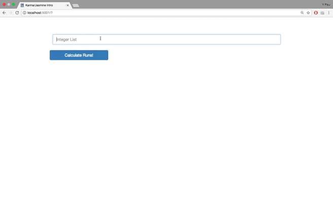

# Integer Streak Search

Y Paul Sussman: June 03rd, 2017; Version 1.0

## Application Overview
This is a simple app: on the server, it searches for a specific pattern among an array of integers; on the client, it validates that an array of integers is being created and sent. I adapted the server-side logic from a code challenge I'd recently completed, and the server setup from my [second Weekend Challenge at Prime](https://github.com/ypaulsussman/prime_weekend_challenge_2).

Really, though, reasoning for this project begins in `karma.conf.js`, and moves directly to the `tests` folder. At the encouragement of one instructor, I built this on a Saturday to teach myself Karma and Jasmine -- and, more broadly, the practice of unit testing.

## Getting Started

Fork, clone, or download the project, then run `npm install`.

You'll also need to download [the most-recent version of Bootstrap 3](http://getbootstrap.com/getting-started/#download), then copy the unzipped `bootstrap-3.3.7-dist` folder into `server/public/vendors`.

## Built With

* HTML 5, CSS 3, Bootstrap, and jQuery;
* Node.js, and Express.js; and
* Karma and Jasmine.

## Learning Value
This was great fun: the examples of Karma/Jasmine implementation that I was able to find online ranged between very basic "hello world" vanilla JavaScript and fairly elaborate AngularJS injections. As a result, I got the opportunity to practice inference and hypothesis-testing more than I had in recent days.

Other takeaways: anyone checking the Git log will see that Karma/Jasmine integration and unit-test writing came after I'd actually built the app. Three hours in I remembered that this is precisely the _inverse_ of the ideal unit-testing sequence: you write your code to pass the tests, not vice versa. Sigh: better here than on production code, I suppose…

Finally - and this could lead to next steps - I was a little surprised by Karma's inability (_as I understand it_) to work with modularized server-side code out of the box. (_Without preprocessing, browsers take the_ `require` _function as_ `undefined`.) The most straightforward way to engage that preprocessing appears to be through Webpack: which, as it happens, was the next build tool I wanted to learn.

## Demo

  

